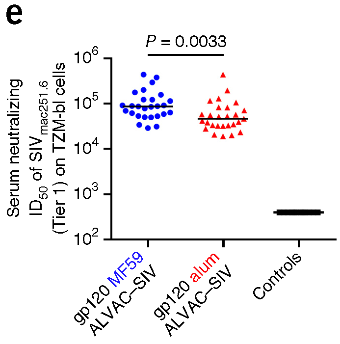
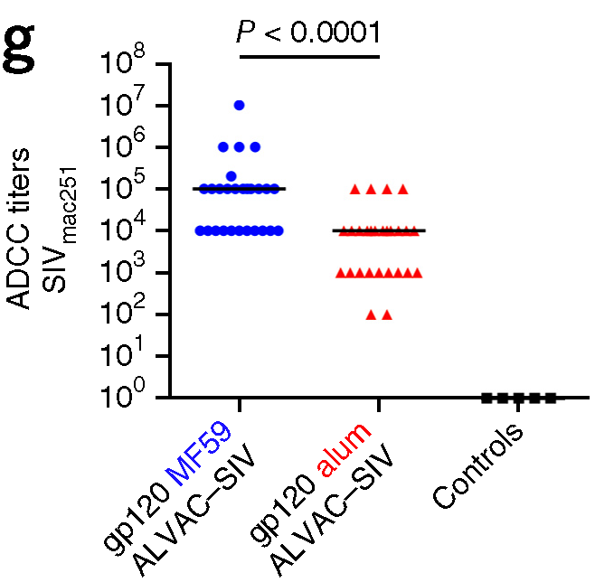

# P162MRV144: source code
ALVAC-SIV alum in RM macaques (Reference: Vaccari M. et al., 2016)

## List of figures:
[Fig. 2e](#fig-2e), [Fig. 2g](#fig-2g)  

### Fig. 2e
  
Fig. 2e: [R code [MD]](code/20200418_P162.Fig2e.code.md), [Input file [CSV]](input/20200418_P162.Fig2e.input.csv)  

### Fig. 2g
  
Fig. 2g: [R code [MD]](code/20200418_P162.Fig2g.code.md), [Input file [CSV]](input/20200418_P162.Fig2g.input.csv)  
