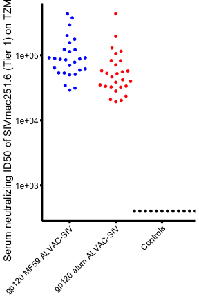

Loading require packages

```r
suppressPackageStartupMessages(library(package = "knitr"))
suppressPackageStartupMessages(library(package = "ggbeeswarm"))
suppressPackageStartupMessages(library(package = "tidyverse"))
```

Set default options/variables

```r
workDir <- dirname(getwd())
opts_chunk$set(tidy = FALSE, fig.path = "../figure/")
options(stringsAsFactors  = FALSE,
	width             = 80,
	readr.num_columns = 0)
```

Read neutralizing antibody data

```r
nabFile <- file.path(workDir,
		     "input/20200418_P162.Fig2e.input.csv")
nabDF <- read_csv(file = nabFile)
```

Plot jitter plot

```r
plotDF <- nabDF %>%
  mutate(Vaccine = c("ALVAC/SIV +gp120-MF59" = "gp120 MF59 ALVAC-SIV",
		     "ALVAC/SIV +gp120-ALUM" = "gp120 alum ALVAC-SIV",
		     "NAIVE" = "Controls",
		     "ALUM" = "Controls",
		     "ALVAC MOCK MF59" = "Controls",
		     "MF59" = "Controls")[Vaccine],
	 Vaccine = factor(Vaccine,
			  levels = c("gp120 MF59 ALVAC-SIV",
				     "gp120 alum ALVAC-SIV",
				     "Controls")),
	 `Neutralization SIVmac251.6.ID#1050 (Tier1)` =
	   gsub(pattern     = "<",
		replacement = "",
		`Neutralization SIVmac251.6.ID#1050 (Tier1)`),
	 `Neutralization SIVmac251.6.ID#1050 (Tier1)` =
	   as.numeric(`Neutralization SIVmac251.6.ID#1050 (Tier1)`))

ggplot(data = plotDF,
       mapping = aes(x = Vaccine, y = `Neutralization SIVmac251.6.ID#1050 (Tier1)`)) +
     geom_beeswarm(mapping = aes(color = Vaccine), cex = 4) +
     scale_y_log10() +
     scale_colour_manual(values = c("gp120 MF59 ALVAC-SIV" = "blue",
				    "gp120 alum ALVAC-SIV" = "red",
				    "Controls" = "black")) +
     labs(x = NULL,
	  y = "Serum neutralizing ID50 of SIVmac251.6 (Tier 1) on TZM-bl cells") +
     theme_minimal() +
     theme(axis.ticks = element_line(size = 1.5),
	   axis.line = element_line(size = 1.5),
	   legend.pos  = "none",
	   axis.title  = element_text(size = 15),
	   axis.text   = element_text(size = 12, color = "black"),
	   axis.text.x = element_text(angle = 45, hjust = 1),
	   panel.grid = element_blank())
```



```r
wilcox.test(formula = `Neutralization SIVmac251.6.ID#1050 (Tier1)` ~
	      Vaccine,
	    data = filter(plotDF, Vaccine != "Controls"))
```

```
## 
## 	Wilcoxon rank sum test
## 
## data:  Neutralization SIVmac251.6.ID#1050 (Tier1) by Vaccine
## W = 532, p-value = 0.003318
## alternative hypothesis: true location shift is not equal to 0
```

Print session info

```r
sessionInfo(/)
```

```
## Error: <text>:1:13: unexpected '/'
## 1: sessionInfo(/
##                 ^
```
